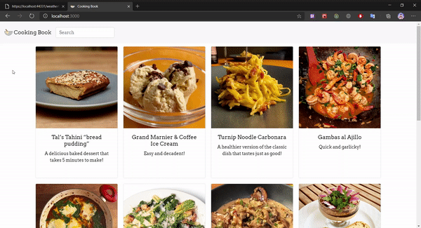
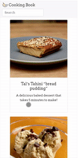

"# cooking-book" 

It is a simple proof of concept app.
There are two modules in the project: backend and frontend. Application contains such features as searching for recipe, listing all recipes and detail view for each one. 

Technologies used: C#, JavaScript, React.js, Redux.js, Redux-thunk, ASP.NET Core, ASP.NET WebAPI, Entity Framework Core 

listing all recipes and detail view for each one
 

searching for recipe
 

Mobile view
 

